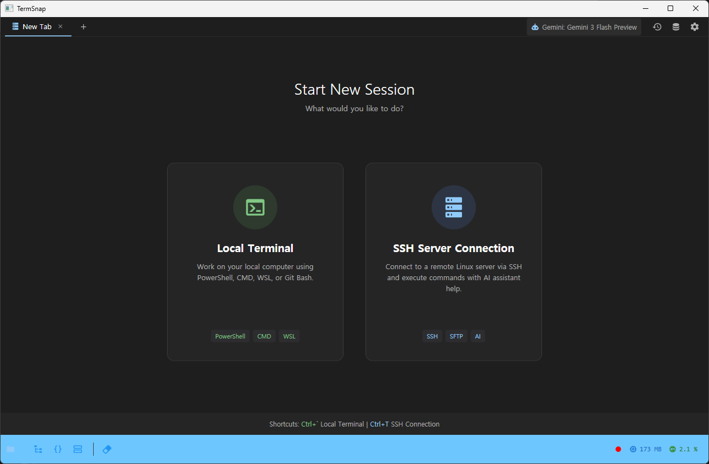
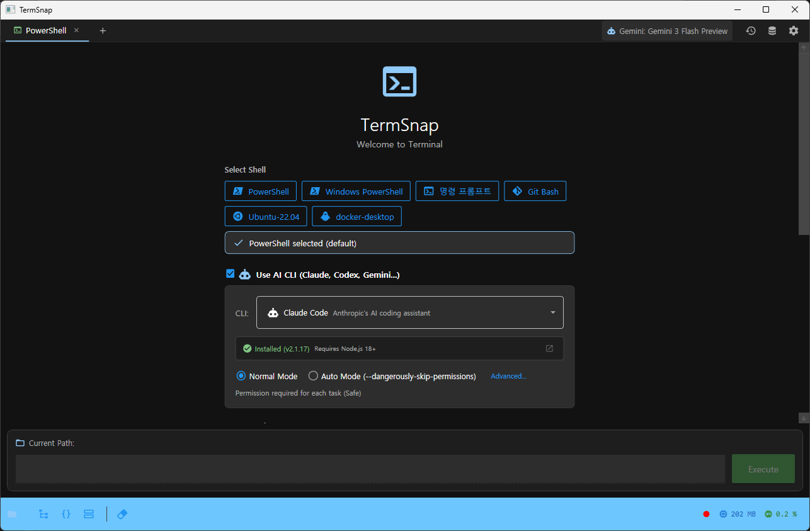
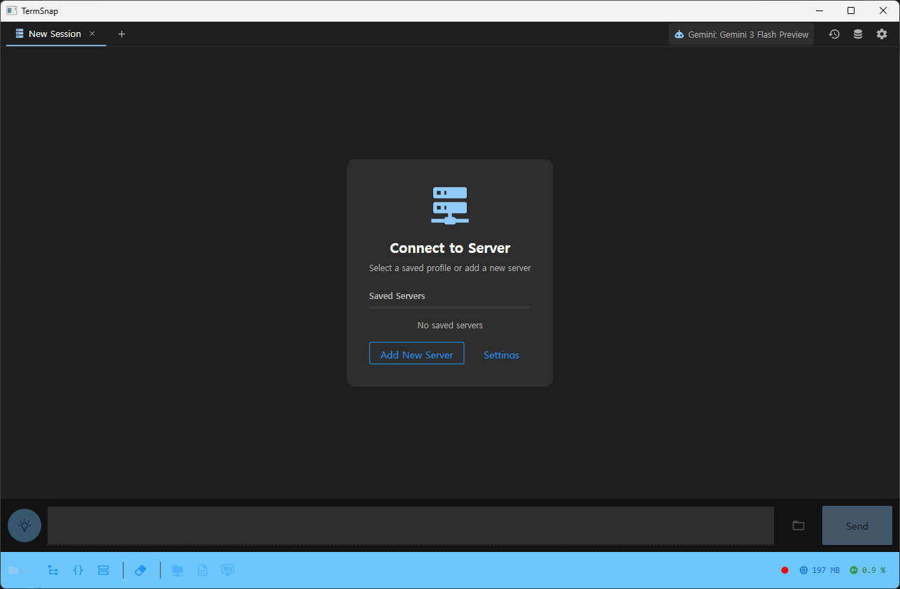
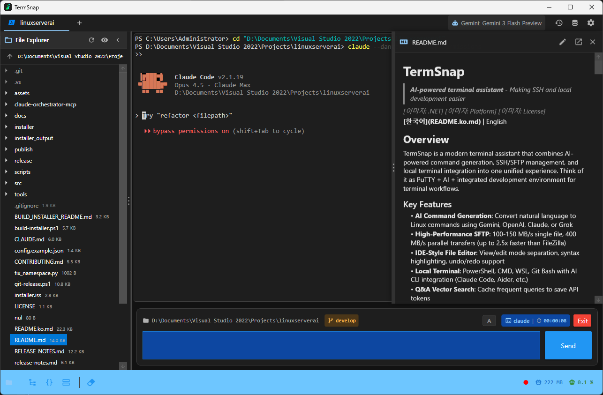

  

<h1 align="center">TermSnap</h1>

AI가 명령어를 만들고, QR 찍으면 폰에서 코딩 — SSH·로컬·모바일 통합 터미널

  
  
  

---

## 이런 불편함, 겪어보셨나요?

서버 관리할 때마다 Linux 명령어를 검색하고, PuTTY·WinSCP·터미널을 따로 열어야 했습니다. "nginx 재시작해줘"라고 치면 AI가 알아서 명령어를 만들어주는 터미널이 있으면 좋겠다고 생각했습니다. 그러다 파일 전송, 여러 서버 탭, 로컬 터미널, AI 코딩 도구, 모바일 원격 접속까지 한 창에 넣게 됐습니다. 그게 TermSnap입니다.

| 불편함 | TermSnap의 해결 |
|--------|----------------|
| 명령어가 생각 안 난다 | "nginx 재시작해줘" → AI가 `sudo systemctl restart nginx`로 변환 |
| PuTTY는 탭도 없다 | 다중 탭 + 서버 프로필 저장 + 원클릭 접속 |
| 파일 전송은 WinSCP를 따로 연다 | SFTP 파일 전송이 터미널 안에 내장 (256KB 버퍼 × 4스트림 병렬) |
| 로컬 터미널은 또 따로 쓴다 | SSH + PowerShell + CMD + WSL + Git Bash를 탭 하나로 통합 |
| 외출 중 서버에 접속할 수 없다 | QR 코드 스캔으로 스마트폰에서 바로 터미널 접속 |
| 위험한 명령어를 실수로 실행한다 | `rm -rf /`, fork bomb 등 24가지 패턴 자동 차단 |

---

## 스크린샷

### 세션 선택

앱을 열면 로컬 터미널과 SSH 서버 연결 중 선택할 수 있습니다.

### 로컬 터미널

PowerShell, CMD, WSL, Git Bash를 지원합니다. Claude Code, Codex, Gemini CLI 같은 AI 코딩 도구도 바로 연동됩니다.

### SSH 서버 연결

저장된 서버 프로필로 한 번에 접속합니다. 비밀번호, .ppk, .pem 키 모두 지원합니다.

### 프로젝트 뷰

파일 탐색기와 여러 터미널을 한 화면에서 사용합니다. VS Code나 Cursor를 바로 열 수도 있습니다.

---

## 누구를 위한 도구인가

### 1. Linux 명령어를 모르는 서버 관리자

배포할 때마다 명령어를 검색하는 개발자, 서버를 직접 다뤄야 하는 비개발 창업자.

**해결:** 자연어 → Linux 명령어 AI 자동 변환, Q&A 벡터 검색으로 반복 질문 즉시 답변(토큰 절약), `rm -rf /` 등 위험 명령어 자동 차단으로 사고 방지

### 2. PuTTY + WinSCP + 터미널을 따로 쓰는 DevOps

여러 서버를 오가며 관리하는 프리랜서, 소규모 팀.

**해결:** SSH + SFTP + 로컬 터미널 + 파일 탐색기 + 서버 모니터링을 탭 하나로 통합, 서버 프로필 저장으로 원클릭 접속, Port Forwarding 관리

### 3. IDE 없이 가볍게 CLI로 개발하고 싶은 개발자

VS Code가 무거워서 터미널 중심으로 작업하는 사람, 외부에서 모바일로 코딩하려는 사람.

**해결:** AI CLI 내장 연동(Claude Code, Codex, Gemini CLI, Aider), 프로젝트 서브탭으로 멀티 터미널 관리, QR 코드 스캔으로 모바일 원격 접속

---

## 주요 기능

### AI 명령어 변환

"nginx 재시작해줘"라고 입력하면 AI가 `sudo systemctl restart nginx`로 변환합니다. Gemini·OpenAI·Claude·Grok·Ollama 5가지 AI를 지원하고, 질문 난이도에 따라 모델을 자동 선택합니다(Smart Router). 한번 물어본 질문은 벡터 검색(FTS5+임베딩)으로 저장되어 다음부터 AI 호출 없이 즉시 답변합니다.

- **5가지 AI 제공자** — Gemini, OpenAI, Claude, Grok, Ollama(로컬)
- **Q&A 벡터 검색** — 한번 물어본 명령어는 저장되어 다음부터 AI 호출 없이 즉시 답변 (토큰 절약)
- **하이브리드 검색** — FTS5 키워드 검색 + Embedding 의미 검색을 결합
- **오류 자동 분석** — 명령어 실행에 실패하면 AI가 원인을 분석하고 수정된 명령어를 제안 (최대 3회 재시도)
- **Smart Router** — 질문 난이도에 따라 Fast/Balanced/Powerful 모델을 자동 선택

### 올인원 터미널

SSH 접속, SFTP 파일 전송(256KB 버퍼 × 4스트림 병렬), 서버 모니터링(CPU·메모리·디스크·업타임), 로컬 터미널(PowerShell·CMD·WSL·Git Bash), 포트 포워딩을 탭 하나에서 전환합니다.

- **서버 프로필 저장** — 호스트, 포트, 인증 정보를 프로필로 저장하고 한 번에 접속
- **3가지 인증 방식** — 비밀번호, .ppk (PuTTY 형식), .pem (OpenSSH 형식)
- **SFTP 파일 전송** — 별도 프로그램 없이 드래그 앤 드롭으로 파일 업로드/다운로드
- **서버 모니터링** — CPU, 메모리, 디스크, 업타임을 실시간 확인
- **Port Forwarding** — SSH 터널링으로 포트 포워딩 관리
- **4가지 쉘** — PowerShell, CMD, WSL (Ubuntu 등), Git Bash
- **인터랙티브 모드** — vim, python, node 같은 인터랙티브 프로그램 지원

### 모바일 코딩

내장 HTTPS 웹서버(Kestrel)를 켜고 QR 코드를 스캔하면, 스마트폰 브라우저에서 서버에 바로 접속합니다. 6자리 PIN + JWT 토큰(Access+Refresh)으로 보안을 유지하고, WebSocket으로 터미널 출력을 실시간 스트리밍합니다. 카페에서도 폰으로 서버를 관리하거나 코딩할 수 있습니다.

- **내장 웹서버** — HTTPS (Kestrel) 웹서버 내장
- **QR 코드 접속** — QR을 스캔하면 모바일 브라우저에서 터미널 사용
- **PIN 인증** — 6자리 PIN으로 로그인 (5분 만료, 5회 시도 제한)
- **JWT 토큰** — Access Token + Refresh Token 기반 인증
- **WebSocket** — 실시간 터미널 출력 스트리밍

### AI 코딩 도구 내장

Claude Code, Codex, Gemini CLI, Aider를 터미널 안에서 바로 실행합니다. 프로젝트 서브탭으로 여러 AI를 동시에 돌릴 수 있고, 파일 탐색기는 서브탭과 무관하게 항상 고정됩니다.

- **서브탭 시스템** — 프로젝트 안에 터미널 여러 개를 탭으로 관리
- **파일 탐색기 고정** — 서브탭을 전환해도 파일 탐색기는 그대로 유지
- **에디터 연동** — VS Code, Cursor를 감지해서 버튼 한 번으로 실행
- **최근 폴더** — 자주 쓰는 폴더를 웰컴 화면에서 바로 열기
- **Git 저장소 복제** — 웰컴 화면에서 바로 `git clone`

### AI 에이전트 시스템

DevOps·Backend·Frontend·Librarian·Oracle 5가지 전문 에이전트가 분야별 작업을 도와줍니다. Swarm 모드로 병렬 실행도 가능합니다.

- **DevOps Agent** — 배포, 인프라, 모니터링 전문
- **Backend Engineer Agent** — API, DB, 서버 로직 전문
- **Frontend Engineer Agent** — UI/UX, 웹 개발 전문
- **Librarian Agent** — 문서 검색, 학습 자료 정리
- **Oracle Agent** — 복잡한 아키텍처 질문 대응

### 안전장치

`rm -rf /`, fork bomb, `dd if=`, `curl|sh` 등 24가지 위험 명령어 패턴을 실행 전에 자동 차단합니다. `sudo`, `reboot`, `kill` 등은 확인 후 실행합니다.

- **즉시 차단** — `rm -rf /`, `dd if=`, `mkfs`, Fork bomb, `curl | sh` 등 시스템을 파괴하는 명령어
- **확인 후 실행** — `rm`, `sudo`, `reboot`, `kill`, `iptables` 등은 확인 팝업 후 실행

### 명령어 관리

자주 쓰는 명령어를 저장하고 빠르게 재사용합니다.

- **스니펫** — 명령어를 저장하고 카테고리별로 정리
- **매개변수 템플릿** — `docker run -p {{port:8080:포트번호}} {{image}}` 형태로 실행 시 값 입력
- **실행 이력** — 모든 명령어 실행 이력을 SQLite에 저장하고 전문 검색 (FTS5)
- **명령어 팔레트** — 단축키로 명령어를 빠르게 검색하고 실행

### 기타

- **다국어** — 한국어, 영어 UI 지원
- **테마** — 다크 모드, 라이트 모드
- **세션 복원** — 앱을 재시작해도 마지막 탭 상태 그대로 복원
- **자동 업데이트 확인** — 새 버전이 있으면 알림
- **통계 대시보드** — 사용 패턴, 명령어 빈도 등 통계 시각화
- **비밀번호 암호화** — Windows DPAPI로 API 키와 비밀번호를 안전하게 저장

---

## 비즈니스 모델 캔버스

<table>
<tr>
<td rowspan="2" width="20%">

**Key Partners**

AI API 제공자 — Google(Gemini), OpenAI(GPT), Anthropic(Claude), xAI(Grok), Ollama(로컬 모델)

오픈소스 생태계 — Renci.SshNet, MaterialDesignThemes, Microsoft .NET 8.0/WPF/ConPTY

</td>
<td width="20%">

**Key Activities**

AI 명령어 변환 엔진 — 자연어→Linux 명령어 변환, Q&A 벡터 검색(FTS5+임베딩), 5가지 AI 통합

보안 및 안전장치 — DPAPI 암호화, 위험 명령어 자동 차단, JWT 인증 기반 모바일 접속

</td>
<td rowspan="2" width="20%">

**Value Propositions**

자연어 → Linux 명령어 AI 자동 변환, Q&A 벡터 검색으로 반복 질문 즉시 답변(토큰 절약), 위험 명령어 자동 차단

SSH + SFTP + 로컬 터미널 + 파일 탐색기 + 서버 모니터링을 탭 하나로 통합

AI CLI 내장 연동(Claude Code, Codex, Gemini CLI, Aider), QR 코드 모바일 원격 접속

</td>
<td width="20%">

**Customer Relationships**

GitHub Issues 피드백, 자동 업데이트 알림, 다국어 UI(한/영), 다크/라이트 테마, 사용 통계 대시보드

</td>
<td rowspan="2" width="20%">

**Customer Segments**

Linux 명령어를 모르는 서버 관리자 — 배포할 때마다 명령어를 검색하는 개발자, 비개발 창업자

PuTTY + WinSCP + 터미널을 따로 쓰는 DevOps — 여러 서버를 관리하는 프리랜서, 소규모 팀

IDE 없이 CLI로 개발하고 싶은 개발자 — 터미널 중심 작업, 모바일 원격 코딩

</td>
</tr>
<tr>
<td>

**Key Resources**

WPF/.NET 8.0 + ConPTY(로컬 터미널), Renci.SshNet(SSH), SQLite+FTS5(전문검색), ONNX 로컬 임베딩 모델, Kestrel HTTPS 웹서버(모바일)

</td>
<td>

**Channels**

GitHub Releases(바이너리 배포), QR 코드 모바일 접속(내장 웹서버), 개발자 커뮤니티/기술 블로그

</td>
</tr>
<tr>
<td colspan="2">

**Cost Structure**

AI API 호출 비용(Q&A 캐싱으로 80% 절감), 1인 개발(오픈소스 활용으로 외부 비용 최소화), 코드 서명 인증서(Windows 배포)

</td>
<td colspan="3">

**Revenue Streams**

Freemium(기본 기능 무료) + Pro 라이선스(AI 에이전트, 모바일 접속, Smart Router) + 기업용 볼륨 라이선스(팀 관리, 중앙 설정)

</td>
</tr>
</table>

---

## 기술 스택

| 영역 | 기술 |
|------|------|
| 프레임워크 | WPF, .NET 8.0, C# |
| UI | MaterialDesignThemes |
| 터미널 | ConPTY (로컬), SSH ShellStream (원격) |
| SSH/SFTP | Renci.SshNet (.ppk, .pem 지원) |
| AI | Gemini, OpenAI, Claude, Grok, Ollama |
| 검색 | SQLite FTS5 + ONNX 로컬 임베딩 |
| 웹서버 | Kestrel HTTPS, WebSocket, JWT |
| 보안 | Windows DPAPI 암호화 |

---

## 다운로드

[Releases](https://github.com/Dannykkh/TermSnap-releases/releases) 페이지에서 최신 버전을 다운로드하세요.

## 시스템 요구사항

- Windows 10 이상
- .NET 8.0 Runtime

## 라이선스

이 소프트웨어는 독점 소프트웨어입니다. 소스 코드는 비공개이며, 바이너리 재배포는 허용되지 않습니다.

Copyright (c) 2026 Dannykkh. All rights reserved.
