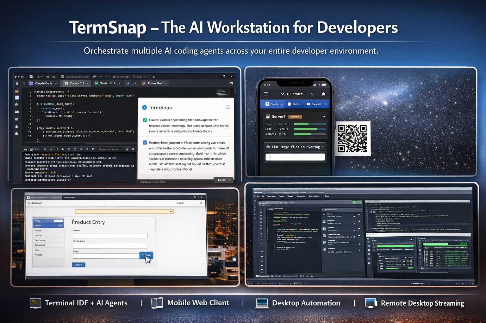
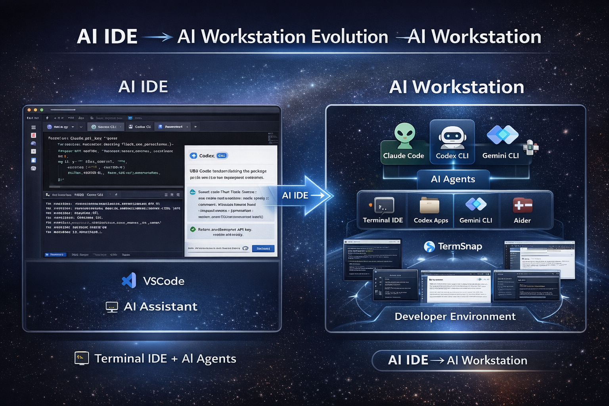
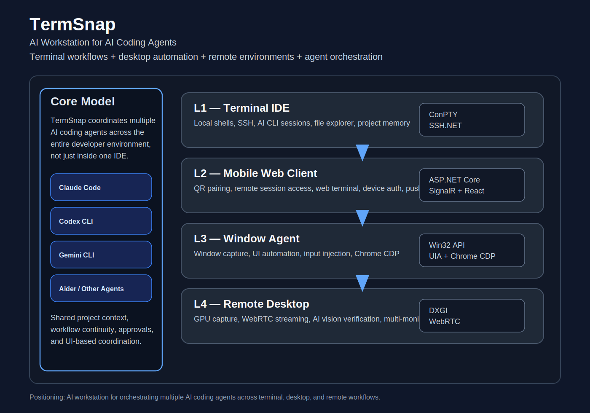
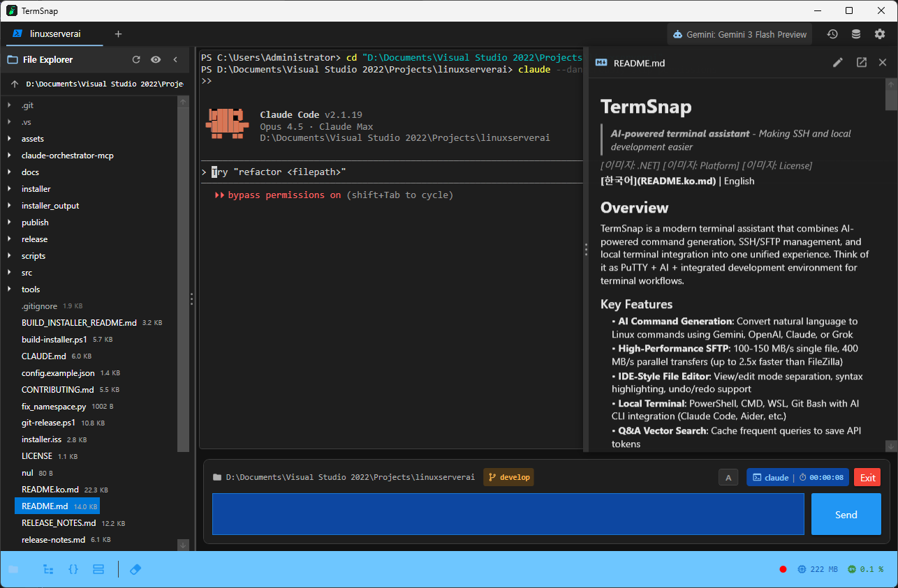
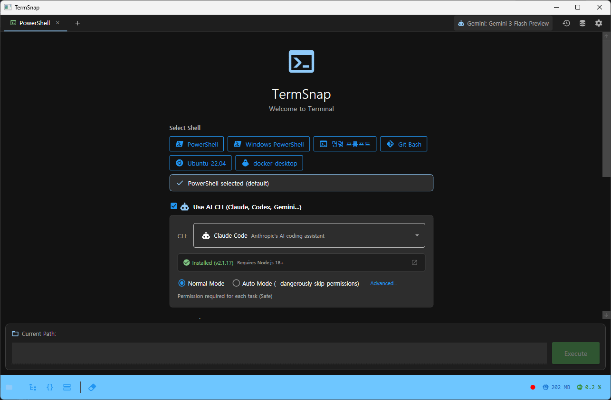
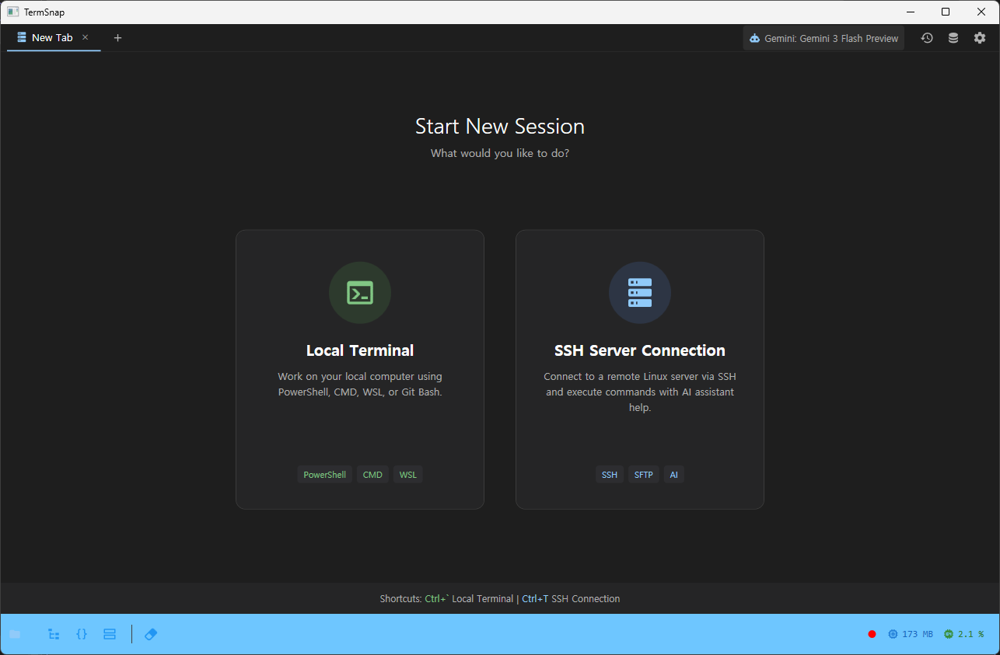
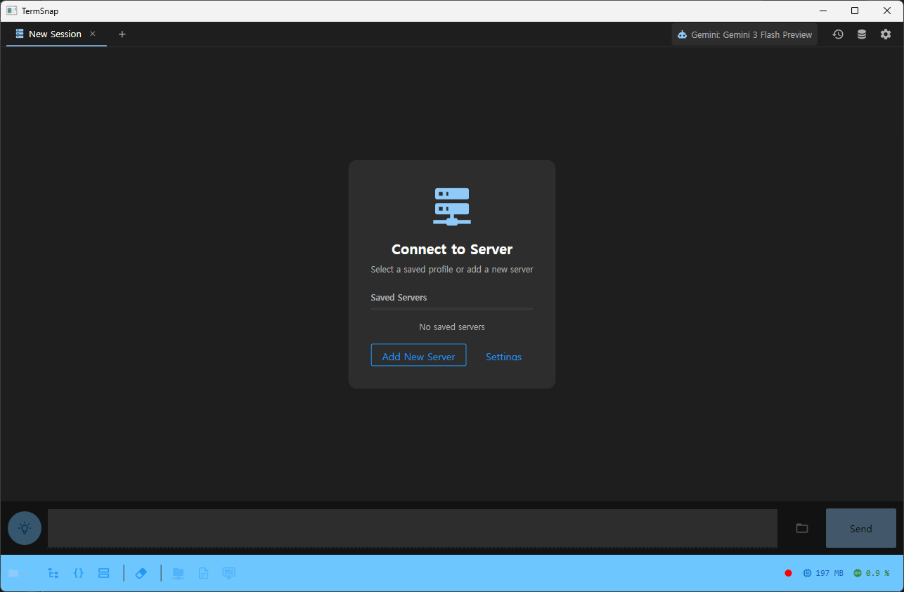

# TermSnap

> **Service Site : http://melstalk.myukai.com/**

> 🌐 Language: **English** | [한국어](https://github.com/Dannykkh/TermSnap/blob/master/README.ko.md)

<p align="center">
  
</p>

> **AI Workstation for AI Coding Agents**

TermSnap is an AI workstation designed to orchestrate multiple AI coding agents across the entire developer environment.

Instead of embedding a single AI assistant inside an IDE, TermSnap coordinates systems such as **Claude Code, Codex CLI, Gemini CLI, and Aider** across terminals, desktop applications, and remote systems.

The goal is to explore a new model of **AI-native developer infrastructure** where multiple AI agents collaborate inside real development workflows.

---

## AI IDE → AI Workstation

<p align="center">
  
</p>

Most modern tools embed AI inside an IDE.

Examples:
- Cursor
- Copilot
- Windsurf

These systems operate **only inside the editor**.

TermSnap explores a different model.

|  | AI IDE | TermSnap |
|---|---|---|
| Scope | Code editor | Entire developer workstation |
| AI role | Assistant | Multiple collaborating agents |
| Environment | IDE | Terminal + Desktop + Remote |
| Automation | Code tasks | System-level workflows |
| Coordination | Inline prompts | AI agent orchestration |

TermSnap treats the **developer workstation itself as the AI platform**.

---

## Architecture

<p align="center">
  
</p>

TermSnap is built around a **4-layer AI workstation architecture**.

| Layer | Component | Purpose |
|---|---|---|
| L1 | Terminal IDE | Local shells, SSH sessions, AI CLI environments |
| L2 | Mobile Web Client | Continue sessions from phone or tablet |
| L3 | Window Agent | AI-driven desktop automation |
| L4 | Remote Desktop | Live workstation streaming with AI vision |

Each layer expands the scope of AI assistance beyond the traditional IDE.

---

## Screenshots

### Terminal IDE

<p align="center">
  
</p>

Run multiple AI coding assistants inside a single workspace.

Supported tools include:
- Claude Code
- Codex CLI
- Gemini CLI
- Aider

All sessions share the same terminal environment and project context.

---

### Mobile Web Client

<p align="center">
  
</p>

Continue development sessions from mobile devices.

Features include:
- QR device pairing
- terminal access
- AI chat mode
- session monitoring
- remote approvals

---

### Window Agent

<p align="center">
  
</p>

The Window Agent allows AI systems to interact with desktop applications.

Capabilities include:
- window capture
- UI automation
- mouse / keyboard injection
- Chrome DevTools automation

---

### Remote Desktop

<p align="center">
  
</p>

Stream the entire workstation using WebRTC.

Features:
- GPU-level screen capture
- low latency streaming
- multi-monitor support
- AI vision verification

---

## Why TermSnap

AI coding tools are powerful but fragmented.

Developers often use multiple systems at once:
- terminal tools
- SSH sessions
- browsers
- desktop apps
- multiple AI assistants

TermSnap provides a unified workstation where these systems collaborate inside real development workflows.

---

## AI Agent Orchestration

TermSnap allows multiple AI systems to collaborate.

Example workflow:

1. **Claude Code** proposes architecture
2. **Codex CLI** generates implementation
3. **Gemini CLI** validates edge cases
4. **Aider** applies repository edits

TermSnap coordinates these agents inside a shared environment.

---

## Level 1 — Terminal IDE

The core workspace for development.

Features include:
- ConPTY terminal
- SSH sessions
- project tabs
- AI CLI sub-tabs
- command catalog
- prompt history
- markdown preview
- system monitor

---

## Level 2 — Mobile Web Client

TermSnap embeds a web server so development sessions can be accessed remotely.

Features:
- QR device pairing
- terminal streaming
- chat interface
- device trust system
- audit logs
- push notifications

---

## Level 3 — Window Agent

The Window Agent allows AI systems to observe and control desktop applications.

Technologies:
- Win32 API
- Windows UI Automation
- Chrome DevTools Protocol

Capabilities:
- window capture
- automated input
- browser automation
- application workflows

---

## Level 4 — Remote Desktop

Remote Desktop streams the full workstation through WebRTC.

Technologies:
- DXGI Desktop Duplication
- WebRTC
- AI vision analysis

---

## Tech Stack

| Category | Technology |
|---|---|
| Framework | .NET / WPF |
| Web | ASP.NET Core + React + SignalR |
| Terminal | ConPTY |
| SSH | SSH.NET |
| Desktop Automation | Win32 API + UI Automation |
| Browser Automation | Chrome DevTools Protocol |
| Streaming | WebRTC |
| Editor | AvalonEdit |
| Voice | Whisper API + sherpa-onnx |
| Storage | SQLite |

---

## Install

Requirements:
- Windows 10 / 11
- .NET 10 Runtime

Download the latest installer from [Releases](https://github.com/Dannykkh/TermSnap-releases/releases).

---

## Build From Source

```bash
git clone https://github.com/Dannykkh/TermSnap.git
cd TermSnap
dotnet build
dotnet run --project src/TermSnap/TermSnap.csproj
```

### Web Client (optional, frontend only)

If you are working on the mobile web client independently:

```bash
cd src/TermSnap/WebClient
npm install
npm run dev
```

---

## Project Status

- Solo developed
- 200+ commits
- Active releases
- 4-layer architecture implemented

For architecture and workflow details:
- [AI Workflow Guide (English)](https://github.com/Dannykkh/TermSnap/blob/master/guide/AI_WORKFLOW_GUIDE.md)
- [AI Workflow Guide (Korean)](https://github.com/Dannykkh/TermSnap/blob/master/guide/AI_WORKFLOW_GUIDE.ko.md)
- [Architecture Decision Records](https://github.com/Dannykkh/TermSnap/tree/master/guide/adr)

---

## Vision

TermSnap explores the concept of an **AI-native developer workstation**.

The long-term goal is to build an open platform where **multiple AI coding agents collaborate inside real development environments**.

---

## Contributing

Issues and pull requests are welcome.

---

## License

Proprietary — personal and non-commercial use only.
